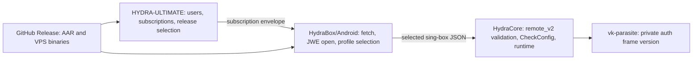

# HydraCore: deletion-first simplification plan

## 1. Назначение документа

Этот документ является исполняемой технической спецификацией для AI coding
agent. Его задача — убрать из HydraCore продуктовую политику, ложные контракты
совместимости, дублирующую release-инфраструктуру и диагностические подсистемы,
которые не обязаны находиться в сетевом ядре.

План координирует два доступных репозитория:

- HydraCore: `C:\Users\user\Desktop\hydracore\hydracore`;
- HYDRA-ULTIMATE: `C:\Users\user\Desktop\hydra\HYDRA-ULTIMATE`.

Android/HydraBox-репозиторий в текущем workspace отсутствует. Любая фаза,
которая удаляет экспортированный libbox API, independently updateable bundle
или mobile runtime API, обязана сначала найти и мигрировать реального Android
consumer. Отсутствие вызова в двух перечисленных репозиториях не доказывает
отсутствие внешнего ABI-потребителя.

План дополняет `docs/VK_PARASITE_4X4_PLAN.md`. Он не дублирует алгоритм
перехода с четырёх на шестнадцать KCP-линий. Изменение topology выполняется по
тому документу; здесь описано, как отвязать topology и release от номера wire,
а затем удалить остальной инфраструктурный балласт.

## 2. Ожидаемый результат

После выполнения всех подтверждённых фаз:

1. `authProtocolVersion` остаётся внутренним байтом формата auth-кадра
   `vk-parasite`, но больше не публикуется как версия HydraCore, capability или
   subscription requirement.
2. HYDRA проверяет, что установлен нужный продукт и нужная роль, а не список
   внутренних milestone-флагов реализации.
3. HydraCore принимает конечный недоверенный sing-box JSON, проверяет его через
   `remote_v2` policy и `CheckConfig`, но не владеет envelope, JWE, profiles,
   permissions и SemVer-политикой HydraBox subscription.
4. GitHub Release содержит только непосредственно используемые runtime assets.
   Документация, schema-файлы, собственный source tarball, checksum sidecars и
   несколько конкурирующих provenance-manifest исчезают.
5. Независимый Android bundle либо удалён как YAGNI, либо сведён к одному
   подписанному manifest, формат которого определяется фактическим updater-
   consumer, а не предполагаемой будущей совместимостью.
6. Runtime API не транслирует одни и те же status/groups/clash/URL-test данные
   одновременно через старые streams и второй aggregate delta protocol.
7. Telemetry использует одну минимальную transport-схему и системный journal;
   HydraCore и HYDRA не владеют двумя каскадами rotation/cursor/archive/report.
8. В рабочем коде удалено ориентировочно 4–5 тысяч строк HydraCore. Если
   операторский telemetry lab в HYDRA не является поддерживаемой продуктовой
   функцией, дополнительно удаляется примерно 5–6.5 тысяч строк HYDRA.

Количество удалённых строк — индикатор, не KPI. Нельзя удалять security,
rollback или trust-boundary validation ради достижения числа.

## 3. Абсолютные инструкции coding-агенту

### 3.1. Запрет локальных запусков

По прямому требованию владельца локально запрещены:

- `go test`, `go build`, `go run`, `go generate`, `make` и gomobile;
- `pytest`, `python verify.py`, compileall и локальная сборка HYDRA;
- Android/Java/NDK build;
- release dry-run, локальная упаковка и публикация;
- локальный `protoc`/protogen, пока владелец отдельно не разрешит codegen.

Агент обязан писать и обновлять тесты, но их выполнение производится только
удалённым CI. В финальном отчёте нельзя писать «tests pass», если получен только
статический diff. Формулировка должна быть: «локально не запускалось по
требованию владельца; подготовлены такие-то CI checks».

Если изменение `.proto` требует checked-in generated Go, а удалённого codegen
job нет, фазу нужно остановить как blocked. Нельзя вручную редактировать
`*.pb.go` и нельзя незаметно запускать локальный generator.

### 3.2. Разрешённые локальные действия

Разрешены только read-only или текстовые действия:

- `git status --short`, `git diff`, `git diff --check`, `git log`;
- `rg`, `rg --files`, чтение файлов и просмотр callers;
- редактирование исходников, тестов и документации;
- проверка отсутствия удалённых символов через `rg`;
- просмотр workflow как текста без исполнения.

Не коммитить `graphify-out/`, временные archives, generated build assets,
локальные logs и unrelated user files.

### 3.3. Правила изменения

1. Перед каждой фазой повторно выполнить `git status --short` в обоих
   репозиториях и сохранить чужие изменения.
2. Перед удалением exported symbol найти production callers во всех доступных
   репозиториях, generated bindings и release scripts. Тестовый caller не
   считается доказательством production use.
3. Сначала обновлять consumer, затем producer. Исключение — additive server
   compatibility из `VK_PARASITE_4X4_PLAN.md`, где сервер разворачивается первым.
4. Один PR решает одну границу ответственности. Не смешивать subscription,
   telemetry и gRPC API в один diff.
5. Не создавать replacement registry, v3 contract, generic negotiation layer,
   compatibility framework или новую dependency.
6. Не переносить удаляемый код в `internal/legacy`, `compat`, `v2` или другой
   каталог. Если consumer мигрирован, код удаляется.
7. Не ослаблять input validation, size limits, path/symlink protection,
   cancellation и error propagation на trust boundary.
8. После каждого diff выполнить repo-wide `rg` по каждому удалённому имени и
   перечислить оставшиеся исторические упоминания.

## 4. Целевая граница ответственности



HydraCore не должен знать:

- как пользователь получил subscription;
- какие profiles показывает HydraBox;
- какую версию приложения желательно установить;
- какие release notes и schemas надо публиковать;
- какой implementation milestone сейчас включён внутри атомарной сборки.

HydraCore обязан знать:

- как безопасно разобрать и проверить конечный конфиг;
- какие protocol/build-role функции действительно скомпилированы;
- как отклонить несовместимый auth frame;
- как безопасно запустить transport и вернуть структурированную runtime ошибку.

## 5. Инварианты, которые запрещено упрощать

Следующие механизмы остаются независимо от размера diff:

- `experimental/libbox.HydraCoreValidateConfig(..., "remote_v2")`;
- duplicate-key, depth/size, unsafe type, local-authority-field и reference-graph
  проверки в `experimental/libbox/hydracore_validation.go`;
- финальный native `CheckConfig` после policy validation;
- equality check внутреннего `authProtocolVersion` и bounds auth frame;
- zero session/generation/epoch checks;
- cancellation и bounded timeouts сетевых запросов;
- Ed25519-подпись manifest, если independently updateable bundle имеет
  подтверждённого consumer;
- release-sequence/anti-rollback поле, если updater реально его проверяет;
- атомарный apply/rollback HYDRA;
- secret redaction и запрет публикации user/password/token/session identity.

Исторические записи `CHANGELOG.md` не переписывать. Они описывают реально
выпущенные wire versions. Удаляются только активные контракты и текущие docs,
которые ошибочно превращают wire byte в версию всего продукта.

## 6. Текущие источники дублирования

### 6.1. Wire и capabilities

Формат auth frame локально зафиксирован в
`transport/call/vk-parasite/auth.go` константой `authProtocolVersion = 9`.
Одновременно то же число повторяется в:

- `common/hydracore/call_enabled.go`;
- `common/hydracore/call_client.go`;
- `common/hydracore/call_server.go`;
- `common/hydracore/call_disabled.go`;
- `common/hydracore/capabilities.go` как `{min,max}`;
- `.github/workflows/hydracore.yml` в двух jq-gates;
- `hydra/contracts/hydracore_calls.py` как exact product gate;
- subscription feature requirements и текущей документации.

Это не negotiation: `min == max`, а несовместимость всё равно окончательно
определяется байтом внутри handshake.

### 6.2. Subscription

HydraCore содержит около 1.4k строк subscription-кода и fixtures:

- `experimental/libbox/hydracore_subscription.go`;
- `experimental/libbox/hydracore_subscription_jwe.go`;
- их tests;
- `contract/subscription/schema.go`;
- `contract/subscription/HYDRA_SUBSCRIPTION_V2.md`;
- две JSON Schema.

При этом HYDRA-ULTIMATE уже генерирует envelope и JWE в
`hydra/services/subscriptions/hydrabox.py` и
`hydra/services/subscriptions/jwe.py`. Core повторно реализует identity,
validity, display, requirements, SemVer, extensions, resources, permissions и
profiles, после чего всё равно вызывает `validateHydraRemoteConfigV2`.

### 6.3. Release

`.github/workflows/hydracore.yml` одновременно создаёт:

- Android `provenance.json`;
- два `linux-provenance-<arch>.json`;
- `hydracore-release-manifest.json`;
- `hydracore-bundle-manifest-v1.json`;
- отдельные `.sha256` почти для каждого файла;
- собственный `hydracore-source.tar.gz`;
- release assets с Markdown/spec/schema.

Publish job повторно проверяет данные, уже проверенные producer jobs, и затем
публикует всё через `dist/*`.

### 6.4. Runtime API

`daemon/started_service.proto` уже имеет `SubscribeStatus`, `SubscribeGroups`,
`SubscribeClashMode` и `SubscribeURLTestEvents`. Поверх них добавлены
`GetRuntimeSnapshot` и polling-based `SubscribeRuntimeEvents`, который каждую
секунду строит полный snapshot и вручную вычисляет delta тех же данных.

### 6.5. Telemetry

HydraCore содержит собственные metric registry, client backlog/lease protocol,
JSONL sink, rotation и state pointer. HYDRA-ULTIMATE затем повторно реализует
cursoring, storage segments, journal ingestion, host/process/kernel sampling,
correlations, findings, reports и export в 19 модулях
`hydra/services/calls_telemetry*.py` общим объёмом более 6k строк.

## 7. Порядок выполнения

Фазы выполняются в указанном порядке. Фаза с пометкой `consumer-gated` не
начинается без production consumer matrix.

| Фаза | Изменение | Репозитории | Gate |
|---|---|---|---|
| 0 | Consumer matrix и baseline | оба + Android | обязательно |
| 1 | Wire decoupling и минимальный Calls gate | оба | HYDRA deploy first |
| 2 | Release/CI cleanup | HydraCore | bundle decision отдельно |
| 3 | Build identity cleanup | HydraCore + Android | consumer-gated |
| 4 | Android bundle delete/simplify | HydraCore + Android | security-gated |
| 5 | Subscription ownership migration | оба + Android | consumer-gated |
| 6 | Runtime events и URLTest API cleanup | HydraCore + Android | consumer-gated |
| 7 | Outbound external info simplification | HydraCore | API сохраняется |
| 8 | VK 4x4 rollout | HydraCore + HYDRA | по отдельному плану |
| 9 | Telemetry collapse | оба | только после rollout observation |
| 10 | Docs, release notes, final dead-code pass | оба | после предыдущих фаз |

## 8. Фаза 0 — production consumer matrix

### Цель

Не принять «нет совпадения в этом repo» за доказательство отсутствия внешнего
consumer.

### Действия агента

1. Найти Android/HydraBox repository и зафиксировать его commit в PR
   description. Не добавлять для этого новый inventory-файл в продуктовый repo.
2. Найти production-вызовы следующих libbox symbols:

   - `HydraCoreCapabilities`;
   - `HydraCoreBuildInfo`;
   - `HydraCoreSubscriptionSchema`;
   - `HydraCoreSubscriptionJWESchema`;
   - `HydraCoreSubscriptionJWEPolicy`;
   - `HydraCoreValidateSubscription`;
   - `HydraCoreInspectSubscription`;
   - `HydraCoreOpenSubscriptionJWE`;
   - `HydraCoreValidateSubscriptionJWE`;
   - `HydraCoreInspectSubscriptionJWE`;
   - `CommandRuntimeEvents`, `RuntimeEventHandler`;
   - `StartURLTestWithOptions`;
   - `LookupOutboundExternalInfo`;
   - dynamic bundle manifest, `capabilitiesSha256` и `HydraNativeLoader`.

3. Для JSON contracts искать не только метод, но и каждое имя поля. Kotlin/
   Java serialization, reflection и generated bindings могут не содержать имя
   Go function напрямую.
4. Для каждого consumer записать в PR description:

   - repository/file/symbol;
   - выполняемое действие;
   - какие поля реально читаются;
   - поведение при отсутствии поля;
   - минимальная версия consumer после миграции.

5. Разделить значения на `used`, `test-only`, `release-only`, `dead` и
   `external-unverified`.
6. Если Android repo недоступен, пометить фазы 3–6 blocked. Продолжить только
   фазы 1, 2 и 7, которые имеют безопасный независимый результат.

### Критерий готовности

Ни один exported symbol не удаляется со статусом `external-unverified`.

## 9. Фаза 1 — отвязать product version от wire byte

### 9.1. Сначала HYDRA-ULTIMATE

Изменить `hydra/contracts/hydracore_calls.py`:

1. Переименовать `supports_exact_vps_calls` в `supports_vps_calls`.
2. Удалить `HYDRACORE_CALLS_WIRE`, `HYDRACORE_CORE_NAME` и
   `_REQUIRED_SERVER_FEATURES`.
3. Проверять только:

   - payload — dictionary;
   - `api_version == 2`;
   - `identity.core_id == "io.hydrabox.hydracore"`;
   - `identity.role == "vps"`;
   - `features.call_vk_parasite is True`;
   - `protocols.call_modes` является list и содержит `"vk_parasite"`.

4. Не требовать exact equality всего `call_modes`: будущий второй mode не
   должен отключать уже поддерживаемый `vk_parasite`.
5. Обновить callers в `hydra/services/calls_infrastructure.py` и
   `hydra/services/kernel_infrastructure.py`.
6. `_has_hydracore_debug_contract` может временно отдельно проверять
   `features.call_vk_telemetry`, пока telemetry-функция существует. Не
   возвращать туда wire/topology/recovery flags.
7. Обновить tests `test_calls_infrastructure.py` и `test_kernel_service.py`:

   - минимальный допустимый payload проходит;
   - неправильные `core_id`, `role` и отсутствие `call_vk_parasite` не проходят;
   - wire fields и implementation flags могут отсутствовать;
   - дополнительные call modes не ломают gate.

8. В `hydra/services/subscriptions/hydrabox.py` перестать добавлять
   `call_vk_four_lane_kcp`, `call_vk_pre_kcp_admission` и
   `call_vk_relay_flow_control`. Для Calls resource оставить только реально
   пользовательскую возможность `call_vk_parasite` и, если общий `call`
   требуется текущему клиенту, `call`.

Это изменение разворачивается раньше HydraCore. Новый минимальный HYDRA gate
принимает как старый подробный capability JSON, так и будущий сокращённый.

### 9.2. Затем HydraCore

Изменить `common/hydracore/capabilities.go`:

1. Удалить `WireCompatibility` и `ProtocolSet.CallVKParasiteWire`.
2. Удалить implementation milestone flags:

   - `call_vk_eight_lane_kcp`;
   - `call_vk_four_lane_kcp`;
   - `call_vk_pre_kcp_admission`;
   - `call_vk_relay_flow_control`;
   - `call_vk_worker_hot_swap`;
   - `call_vk_flow_migration`;
   - `call_vk_turn_tcp_fallback`;
   - `call_vk_transport_health`.

3. Удалить `call_vk_parasite_client` и `call_vk_parasite_server`, если consumer
   matrix подтверждает, что `identity.role` полностью заменяет их. Не хранить
   один и тот же role двумя способами.
4. Пока Android consumer не мигрирован, остальные поля удалять только согласно
   matrix. Известный VPS consumer требует лишь identity, Calls feature и mode.
5. `RemotePolicy` не должен повторять whitelist из
   `hydracore_validation.go`. Удалить его из JSON после подтверждения Android
   consumer; validator остаётся каноническим источником истины.
6. `SupportsCallMode` оставить runtime helper, но он не обязан жить в большом
   capability registry. Не создавать для него interface/registry.

Удалить `callWireMin`/`callWireMax` из:

- `common/hydracore/call_enabled.go`;
- `common/hydracore/call_client.go`;
- `common/hydracore/call_server.go`;
- `common/hydracore/call_disabled.go`.

Обновить:

- `experimental/libbox/hydracore_capabilities.go`;
- `experimental/libbox/hydracore_capabilities_test.go`;
- `.github/workflows/hydracore.yml`;
- `HYDRACORE.md`;
- `docs/CALL_VK_TELEMETRY.md`.

`transport/call/vk-parasite/auth.go` не менять, кроме комментария при
необходимости. `authProtocolVersion = 9`, `frame[4]` и strict equality остаются.

Behavioral emulator tests можно переименовать с `TestWireV9...` на имена
проверяемого поведения. `TestAuthRequestRejectsPreviousWireVersion` остаётся:
он действительно проверяет layout compatibility.

### 9.3. Target capability shape

После consumer migration capability JSON должен содержать только поля, по
которым хотя бы один consumer ветвится. Для известных VPS paths минимальный
ориентир:

```json
{
  "api_version": 2,
  "identity": {
    "core_id": "io.hydrabox.hydracore",
    "core_version": "<release version>",
    "role": "vps"
  },
  "features": {
    "call_vk_parasite": true,
    "call_vk_telemetry": true
  },
  "protocols": {
    "call_modes": ["vk_parasite"]
  }
}
```

`call_vk_telemetry` удаляется после фазы 9, если специальный telemetry contract
исчезает. Не добавлять `wire`, lane count, min/max, recovery generation,
workers-per-call или build tags.

### 9.4. Remote CI only

HYDRA remote CI должен выполнить relevant contract/kernel/calls tests и полный
`python verify.py`. HydraCore remote CI должен выполнить base suite,
`with_call_client`, `with_call_server` и race job. Локально команды не запускать.

### 9.5. Acceptance

- В active code отсутствуют `call_vk_parasite_wire`, `callWireMin`,
  `callWireMax` и перечисленные milestone flags.
- `authProtocolVersion` существует только внутри transport auth layout и tests.
- Старый подробный capability JSON всё ещё принимается новым HYDRA gate.
- Новый сокращённый JSON принимается тем же gate.
- Нет `wire v10`, negotiation или новой capability schema.

## 10. Фаза 2 — упростить CI и GitHub Release

### 10.1. Test job

В `.github/workflows/hydracore.yml` оставить:

- одну baseline verification;
- `go test ./...`;
- `with_wireguard` libbox test;
- role-specific `with_call_client` test;
- role-specific `with_call_server` test;
- один существующий Calls race test;
- inherited-runtime race test, если он не дублирует base suite по режиму race.

Удалить:

- generic `with_call` job, если client/server role jobs покрывают его packages;
- отдельный `TestWireV9` step, потому что те же package tests уже запускаются;
- blocking `verify_hydracore_performance.sh` из обычного PR/release workflow;
- `verify_attribution_boundaries.sh` и self-referential string allowlist.

Не создавать новый benchmark framework. Если после 4x4 rollout нужен benchmark,
использовать manual/scheduled удалённый job без release-blocking threshold до
появления стабильного baseline.

`verify_upstream_baseline.sh` запускать один раз в test job. Android/Linux jobs
работают с тем же workflow SHA; не повторять grep policy в каждом producer job.
Не сериализовать независимые jobs только ради этой проверки.

### 10.2. Android build

Удалить step `Set HydraCore build version`, который создаёт mutable/synthetic
Git tags. `cmd/internal/build_libbox/main.go` уже читает
`HYDRACORE_BUILD_VERSION`; использовать файл `release/HYDRACORE_VERSION` и
этот env/ldflag path как единственный источник.

В `cmd/internal/build_libbox/main.go` перестать всегда собирать
`libbox-legacy.aar`. Если production consumer matrix не содержит API 21
consumer, удалить legacy variant и относящийся код. Не заменять его новым
matrix/config flag. При реальной необходимости legacy artifact должен
собираться отдельным явно вызываемым target, а не удваивать каждый Hydra build.

### 10.3. Release assets

Безусловно удалить из `dist` и GitHub Release:

- `HYDRA_SUBSCRIPTION_V2.md`;
- `hydra-subscription-v2.schema.json`;
- `hydra-subscription-jwe-v2.schema.json`;
- все их `.sha256`;
- `hydracore-source.tar.gz` и checksum — GitHub уже предоставляет source
  archives для release tag;
- `provenance.json`;
- `linux-provenance-amd64.json`;
- `linux-provenance-arm64.json`;
- `hydracore-release-manifest.json`;
- все standalone `.sha256` sidecars.

GitHub artifact transfer между jobs остаётся. Publish job доверяет artifacts
из собственных required producer jobs и выполняет один runtime smoke:

- ожидаемые файлы существуют;
- Linux tar содержит ровно `sing-box`;
- `sing-box version` содержит release version;
- один минимальный `hydra capabilities` check подтверждает VPS identity/role.

Не повторять capability jq в Linux producer и publish job одновременно.

### 10.4. Явный allowlist

Запрещён `gh release upload "$version" dist/*`.

Если independently updateable bundle удалён, release allowlist должен быть
ровно таким:

```text
hydracore-client-libbox.aar
hydracore-client-libbox-sources.jar
hydracore-vps-linux-amd64.tar.gz
hydracore-vps-linux-arm64.tar.gz
```

Если bundle подтверждён, к allowlist добавляются только asset names, которые
читает updater, плюс один manifest и одна signature. Никаких Markdown,
schemas, capabilities dump и checksum sidecars.

Перед upload shell step обязан проверить отсутствие неожиданных файлов в
`dist`, сравнив sorted file list с literal allowlist. Не использовать glob как
источник истины.

### 10.5. Release notes

`release/HYDRACORE_RELEASE_NOTES.md` должен содержать только текущий release,
не копию всей истории. История остаётся в `CHANGELOG.md`.

В рамках фазы:

1. заменить stale debug.39 notes на краткое описание текущей версии;
2. удалить все `Previous debug.* notes`;
3. не создавать release-note generator;
4. каждый следующий release вручную заменяет один короткий файл.

### 10.6. Files to delete when no longer referenced

- `release/verify_attribution_boundaries.sh`;
- `release/verify_hydracore_performance.sh`;
- `release/HYDRACORE_PERFORMANCE_BASELINE.env`;
- относящийся только к ним documentation/test glue.

License, `CREDITS.md`, `THIRD_PARTY_NOTICES.md` и actual attribution не удалять.

### 10.7. Acceptance

- Workflow заметно короче и содержит один источник проверки каждого свойства.
- В workflow нет `dist/*`, `git archive`, `sha256sum`, `provenance` и
  subscription docs copy.
- GitHub Release создаётся из фиксированного runtime allowlist.
- Publish job не собирает уже собранные producer artifacts заново.
- Debug/stable release semantics и `latest` behavior сохранены.

## 11. Фаза 3 — удалить дублирующий BuildInfo API (`consumer-gated`)

Текущий `experimental/libbox/hydracore_build_info.go` вручную повторяет source
repository, upstream repository/branch/tag/commit, gomobile, Java, NDK, API,
build tags и lineage. Те же значения существуют в `release/UPSTREAM_BASELINE`,
workflow и linker flags.

### Предпочтительный путь

1. Перевести consumer на `HydraCoreCapabilities` для `core_version`/`role` и на
   GitHub release metadata для source provenance.
2. Удалить:

   - `experimental/libbox/hydracore_build_info.go`;
   - `experimental/libbox/hydracore_build_info_test.go`;
   - `hydraCoreSourceCommit` linker flag из
     `cmd/internal/build_libbox/main.go`.

3. `release/UPSTREAM_BASELINE` оставить build-time источником baseline.
4. Не добавлять новый runtime `BuildMetadata`, `Lineage` или generated JSON.

Если Android показывает diagnostic screen, ему достаточно version, role и,
при реальной необходимости, source commit из release/update metadata. Не
передавать весь toolchain через native ABI.

### Acceptance

- В repo нет `HydraCoreBuildInfo` и `hydraCoreSourceCommit`.
- Toolchain values существуют только там, где реально управляют build.
- Android diagnostic path продолжает показывать version без второго JSON API.

## 12. Фаза 4 — independently updateable Android bundle (`security-gated`)

### 12.1. Decision gate

Найти production decoder/updater для:

- `hydracore-bundle-manifest-v1.json`;
- `hydracore-bundle-manifest-v1.sig`;
- extracted per-ABI `.so` assets;
- `HydraNativeLoader`;
- `capabilitiesSha256`;
- `releaseSequence` и `keyId`.

Если consumer отсутствует, выполнить Path A. Если присутствует — Path B.

### 12.2. Path A — consumer отсутствует

Удалить целиком:

- `cmd/internal/build_core_bundle/`;
- `cmd/internal/build_libbox/android_loader_patch.go`;
- `cmd/internal/build_libbox/android_loader_patch_test.go`;
- вызов `patchAndroidLoader`;
- `cmd/internal/write_capabilities/`, если он больше нигде не используется;
- workflow steps build/sign bundle;
- bundle-specific variables/secrets references;
- extracted per-ABI release `.so` files;
- manifest/signature/checksums/capabilities asset.

Оставить обычный AAR. Не сохранять «на будущее» manifest structs или loader
parser.

### 12.3. Path B — consumer существует

Сначала записать фактически читаемые consumer fields. Manifest оставить только
с ними. Предпочтительный минимальный набор:

- scalar `schemaVersion`;
- `distributionId`;
- `version`;
- monotonic `releaseSequence`;
- `publishedAt`, только если consumer проверяет freshness;
- `keyId`;
- artifacts: `abi`, `assetName`, `sizeBytes`, `sha256`, `minSdk`.

Удалить, если consumer не читает:

- `sourceCommit`, `upstreamCommit`;
- `coreApiMajor/coreApiMinor`;
- exact `{min,max}` schema ranges;
- `subscriptionSchema`;
- `capabilitiesSha256` и отдельный capabilities JSON.

Manifest создавать и подписывать один раз в publish job. Не создавать сначала
unsigned copy в Android job, затем второй раз пересобирать тот же manifest.

Ed25519 verification, trusted embedded public key, key id, artifact digest,
size/ABI validation, atomic replace и anti-rollback не ослаблять.

289-строчный JVM constant-pool/ZIP rewriter не заменять другим binary parser
или новой dependency. Updater должен загружать проверенный `.so` через
Android-owned source-level loader. Если фактический gomobile lifecycle не
позволяет это сделать без classfile rewriting, independently updateable
bundle признаётся неподходящей архитектурой и удаляется по Path A.

### Acceptance

- Path A: release содержит AAR, но не bundle infrastructure.
- Path B: один manifest, одна signature, нет capabilities/checksum/provenance
  sidecars, loader не переписывает JVM bytecode.

## 13. Фаза 5 — вынести Hydra Subscription из ядра (`consumer-gated`)

### 13.1. Целевая data flow

1. HYDRA-ULTIMATE формирует subscription envelope и при необходимости JWE.
2. HydraBox/Android загружает payload, проверяет JWE, validity и product
   requirements, показывает profiles и выбирает resource.
3. HydraBox передаёт выбранный raw sing-box JSON в
   `HydraCoreValidateConfig(config, "remote_v2")`.
4. Только при `valid == true` config передаётся в runtime apply/check path.

Core не получает subscription envelope и не выбирает profile.

### 13.2. HYDRA-ULTIMATE

Оставить product-owned server logic в:

- `hydra/services/subscriptions/hydrabox.py`;
- `hydra/services/subscriptions/jwe.py`;
- `hydra/services/subscriptions/server.py`.

Сократить `requirements.core.features` до пользовательских функций. Не
публиковать lane count, wire, recovery, telemetry или build internals.

Не создавать `hydra.io/subscription/v3` только ради переноса ownership.
Существующий v2 envelope может продолжить существовать на product side.

### 13.3. HydraBox/Android

1. Использовать уже установленную platform/library JWE реализацию. Не копировать
   Go crypto/parser line-by-line.
2. Сохранить ограничения algorithm/type/content-type, key size, maximum payload,
   authenticated decryption и error redaction.
3. Проверять validity/product requirements до отображения profiles.
4. После выбора resource вызвать core `remote_v2` validator.
5. Добавить migration tests на существующие plain/JWE v2 fixtures.
6. Выпустить consumer раньше core cleanup и поднять минимальную HydraBox version
   на product side, если старый app иначе вызывает удаляемый libbox ABI.

### 13.4. HydraCore cleanup

После подтверждённого rollout удалить:

- `experimental/libbox/hydracore_subscription.go`;
- `experimental/libbox/hydracore_subscription_jwe.go`;
- их tests;
- `contract/subscription/` целиком;
- `github.com/go-jose/...` dependency, только если repo-wide search
  подтверждает отсутствие других callers;
- subscription aliases/fields из capabilities;
- subscription schema fields из bundle manifest, если bundle сохранился.

В `experimental/libbox/hydracore_validation.go` оставить public
`HydraCoreValidateConfig` и `remote_v2`. Whitelist безопасных типов хранить
только здесь, не экспортировать как capabilities.

### 13.5. Удаляемые exported symbols

После consumer migration должны исчезнуть все десять subscription methods,
перечисленные в фазе 0. Не оставлять stubs, возвращающие deprecated error:
старый consumer всё равно не сможет корректно обработать subscription без
логики, а вечный stub сохраняет ложный ABI contract.

### 13.6. Rollout и rollback

1. Выпустить HydraBox, который больше не вызывает subscription libbox API.
2. Проверить product telemetry/crash reports на отсутствие старых вызовов.
3. Только затем выпустить HydraCore без API.
4. Rollback app на версию, зависящую от старого API, после core cleanup
   запрещён; release notes должны явно фиксировать минимальную app version.

### 13.7. Acceptance

- В core отсутствуют subscription envelope/JWE/profile/schema types.
- `remote_v2` validation и final config validation сохранены.
- HYDRA/HydraBox владеют product semantics.
- Release не содержит subscription documentation assets.

## 14. Фаза 6 — убрать дублирующий runtime event protocol (`consumer-gated`)

### 14.1. Aggregate runtime events

Если Android consumer использует существующие dedicated streams, удалить:

- gRPC `SubscribeRuntimeEvents`;
- `RuntimeEventRequest`, `RuntimeEventType`, `RuntimeEvent`, `RuntimeEvents`;
- `CommandRuntimeEvents`;
- `RuntimeEventHandler` и `SetRuntimeEventHandler`;
- `handleRuntimeEventsStream`;
- conversion DTO/functions из `experimental/libbox/command_types.go`;
- `FeatureSet.RuntimeEvents` и runtime event schema metadata.

Оставить:

- `SubscribeStatus`;
- `SubscribeGroups`;
- `SubscribeClashMode`;
- `SubscribeURLTestEvents`;
- `GetRuntimeSnapshot` как one-shot initial read, только если consumer его
  реально использует.

Если consumer использует aggregate stream, сначала перевести его на one-shot
snapshot плюс dedicated streams. Consumer разворачивается первым.

После удаления polling delta loop удалить ставшие dead:

- `populateRuntimeTrafficRates`, если rates уже выдаёт status stream;
- `equalURLTestSessions`;
- aggregate interval constants/normalizer, если URLTest stream получает свой
  маленький local normalizer.

Generated protobuf files изменяются только штатным generator в разрешённом
удалённом окружении. Ручные изменения `*.pb.go` запрещены.

### 14.2. Managed URLTest

Consumer matrix должна определить, какие из девяти параметров
`StartURLTestWithOptions` реально передаются не-default значениями.

Предпочтительная поверхность:

- `StartURLTest(groupTag)`;
- при доказанном use-case — `StartURLTest(groupTag, targetOutboundTag)`;
- `GetURLTestSession`, `CancelURLTest`, `SubscribeURLTestEvents` только если UI
  показывает progress/cancel.

Удалять неиспользуемые `priority`, `exclude`, custom URL, caller-controlled
concurrency/deadline и `force`. Timeout/concurrency остаются internal constants.
Не заменять positional method новым options object — это та же сложность в
другой форме.

Если UI не показывает историю, хранить только текущую/latest session per group,
а не глобальный retained list из 64 sessions.

### 14.3. Acceptance

- Каждое состояние доставляется одним stream, а не dedicated + aggregate.
- Нет polling полного protobuf snapshot ради вычисления вручную созданного delta.
- Mobile API содержит только параметры, которыми consumer реально управляет.

## 15. Фаза 7 — упростить outbound external info без изменения API

Сохранить `LookupOutboundExternalInfo(outboundTag)` и response `{ip,
countryCode}`. Удалить внутреннюю сложность:

1. Удалить `outboundExternalInfoResolver` из `daemon/instance.go`.
2. Удалить cache entry, mutex, `singleflight.Group`, fresh/stale TTL и перенос
   старого country code.
3. Из RPC handler после разрешения outbound напрямую вызвать bounded fetch.
4. Оставить общий 4.5s timeout, instance cancellation, custom outbound dialer,
   TLS roots/time, redirect refusal, body size limit и IP/country validation.
5. Два endpoint можно оставить: fallback loop короткий и обеспечивает полезную
   деградацию. Не создавать provider interface/registry.
6. Tests сократить до:

   - invalid request/tag;
   - primary success;
   - primary failure + fallback success;
   - invalid/oversized response;
   - context cancellation.

Не тестировать cache, stale carry-over и singleflight после их удаления.

Acceptance: public gRPC/libbox API не изменился; implementation не имеет
resolver state и per-outbound cache.

## 16. Фаза 8 — topology 4x4

Выполнить topology/recovery части `docs/VK_PARASITE_4X4_PLAN.md` отдельной
серией commits. Разделы того документа про capability gate и release assets
считаются уже выполненными фазами 1–2 этого master-plan и второй раз не
реализуются. Для данного master-plan важны только зависимости:

- wire byte не меняется;
- topology не публикуется capability range;
- HYDRA gate уже минимизирован фазой 1;
- server rollout предшествует client rollout;
- telemetry cleanup фазы 9 начинается только после observation window.

Не смешивать удаление subscription/runtime API с изменением lane masks,
recovery quorum и server compatibility.

## 17. Фаза 9 — collapse telemetry после observation window

### 17.1. Gate

До начала должны быть выполнены:

- server и client 4x4 rollout;
- сохранён достаточный production observation interval;
- зафиксирован короткий список metrics, которые реально повлияли хотя бы на
  одно operational decision;
- экспортированы нужные исторические experiment reports.

Telemetry нельзя удалять перед rollout только ради сокращения LOC: она нужна
для проверки новой topology.

### 17.2. Минимальная core telemetry

Оставить только показатели, необходимые для ответов:

- session поднята или нет;
- сколько lanes active/usable;
- где ломается setup: VK, TURN, DTLS или inner auth;
- текущий RTT/retransmission/goodput;
- queue drops/backpressure;
- recovery/reset/session replacement.

Ориентир — 20–30 metrics, не сотни. Runtime CPU/RSS/kernel/network-device
metrics удалить из core: их уже собирает host monitoring.

В `transport/call/telemetry/metrics.go` удалить глобальные пересекающиеся
`ServerRequired`, `ClientRequired` и `TunnelMetrics`. Оставить константы реально
эмитируемых metrics и короткие explicit lists непосредственно в client/server
emitter. Не вводить code-generated schema.

Удалить unused public knobs из `vkparasite.ServerOptions`:

- `TelemetryStateDirectory`;
- `TelemetryOutputPath`;
- `TelemetryInterval`.

Production caller их не задаёт; tests должны создавать sink/emitter напрямую,
если такая unit seam ещё нужна.

### 17.3. Native storage

Предпочтительный transport — одна JSON record на одну строку systemd journal с
фиксированным marker. Использовать существующий logger/stdout service path.

После перехода удалить custom storage:

- `transport/call/telemetry/sink.go` и sink-specific tests;
- state pointer;
- custom segment handoff;
- собственную rotation;
- `/run/hydra/calls-telemetry.jsonl` contract.

Не удалять symlink/path protections, оставив обычную file write. File sink
исчезает целиком; journal берёт lifecycle/rotation/security на себя.

Client telemetry, проходящая внутри authenticated control frames, может
сохранить bounded record size, rate limit и drop-on-overflow. Упростить backlog:
сохранять latest snapshot и небольшой event queue; не гарантировать доставку
diagnostic telemetry ценой transport liveness.

### 17.4. HYDRA-ULTIMATE

Рекомендованный deletion-first вариант: operator experiment framework не
является продуктовым runtime API и удаляется. Оператор использует structured
journal и существующий monitoring.

Удалить:

- `hydra/services/calls_telemetry*.py`;
- Calls telemetry application port и bootstrap wiring;
- traffic-daemon sampling/record hooks;
- CLI `calls telemetry start/status/report/tail/follow/mark/export/stop`;
- относящиеся tests и architecture budgets;
- отдельные telemetry state/data directories.

Сохранить обычный Calls status/health и документировать одну команду чтения
structured journal. Не писать новый analyzer framework.

Если владелец подтверждает, что experiment reports — поддерживаемая функция,
оставить только:

- journal reader с cursor;
- `tail`/`export` raw records;
- один компактный summary текущего session health.

Удалить в любом случае дублирующие host/kernel/process collectors,
correlations, percentile lab, findings engine, storage segmentation и второй
archive rotation. Offline postmortem analysis не должна быть частью always-on
оркестратора.

### 17.5. Security

Structured records не содержат email, password, VK token, join link, raw
session ID или payload. User/session identity либо отсутствует, либо
анонимизируется один раз на HYDRA boundary. Journal parser ограничивает line
size и принимает только JSON object с известным marker/schema.

### 17.6. Acceptance

- Core не владеет telemetry file rotation/state pointer.
- HYDRA не перечитывает один поток через native file и journal параллельно.
- Нет одинаковых metric allowlists в трёх core lists и двух Python modules.
- Transport correctness/recovery не зависит от успешной отправки telemetry.
- После полного варианта удалены operator telemetry application service и
  тысячи строк аналитического кода.

## 18. Фаза 10 — финальная документация и dead-code pass

Обновить только актуальные документы:

- `HYDRACORE.md`;
- `docs/CALL_VK_TELEMETRY.md` или удалить его при удалении специальной telemetry;
- Android/update docs в фактическом consumer repo;
- HYDRA architecture/CLI/reference docs;
- верхнюю запись `CHANGELOG.md` каждого затронутого repo;
- короткий текущий `release/HYDRACORE_RELEASE_NOTES.md`.

Не переписывать старые changelog entries с wire v1–v9.

Выполнить read-only searches и классифицировать остатки:

```text
call_vk_parasite_wire
callWireMin / callWireMax
call_vk_four_lane_kcp
HYDRACORE_CALLS_WIRE
HydraCoreBuildInfo
HydraCore*Subscription*
hydracore-bundle-manifest
capabilitiesSha256
provenance
.sha256
SubscribeRuntimeEvents
RuntimeEventHandler
TelemetryStateDirectory / TelemetryOutputPath
calls-telemetry.jsonl
dist/*
Previous debug.
```

Разрешённые остатки — исторический changelog, migration release notes и
fixtures, которые проверяют чтение реально поддерживаемого старого user data.
Каждый другой остаток должен иметь production caller или быть удалён.

## 19. Рекомендуемая структура PR/commits

Не делать один giant PR. Минимальная последовательность:

1. HYDRA: relax Calls capability consumer и subscription requirements.
2. HydraCore: remove public wire/milestone capability fields.
3. HydraCore: simplify workflow/assets/checks and remove legacy AAR.
4. HydraCore/Android: remove BuildInfo consumer и API.
5. HydraCore/Android: delete bundle либо simplify signed manifest.
6. Android/HYDRA: move subscription consumption to product side.
7. HydraCore: delete subscription subsystem, сохранив `remote_v2` validator.
8. Android: migrate runtime event/URLTest consumers.
9. HydraCore: delete aggregate runtime events and unused URLTest options.
10. HydraCore: simplify outbound external info implementation.
11. HydraCore/HYDRA: выполнить 4x4 rollout по отдельному плану.
12. HydraCore/HYDRA: collapse telemetry после observation window.
13. Оба repo: final docs/dead-code cleanup.

Каждый commit должен быть revertable без unrelated formatting. Cross-repo
rollout order указывается в PR description.

## 20. Remote CI matrix

Команды ниже являются требованиями к удалённому CI, не инструкцией запускать их
локально.

### HydraCore

- base Go package suite;
- WireGuard libbox tagged suite;
- Calls client-role tagged suite;
- Calls server-role tagged suite;
- Calls telemetry/transport race suite до фазы 9;
- Android AAR build и ABI/version inspection;
- Linux amd64/arm64 build;
- release artifact inventory check;
- package/API tests для изменённых subscription/runtime/external-info областей.

Не добавлять отдельный `TestWireV9` job, если package suite уже выполняет эти
tests. Не возвращать generic `with_call` job при наличии client/server jobs.

### HYDRA-ULTIMATE

- targeted calls infrastructure/kernel contract tests;
- subscription generation/JWE tests при фазе 1/5;
- architecture/boundary tests для удалённых application ports;
- полный `python verify.py` в remote CI;
- Linux integration smoke для runtime/apply изменений;
- upgrade/rollback smoke, если меняется минимальная HydraBox/HydraCore version.

### Android/HydraBox

- existing plain/JWE subscription fixtures;
- rejected signature/tag/key/oversize cases;
- selected resource проходит `remote_v2` validator;
- old libbox subscription methods больше не вызываются;
- если bundle сохранён: signature, digest, ABI, anti-rollback, atomic replace и
  crash-safe fallback;
- runtime streams/UI behavior после удаления aggregate events.

## 21. Rollout order

### Wire/capabilities

1. HYDRA minimal consumer.
2. HydraCore without wire/milestone fields.
3. Отдельно server-first/client-second topology rollout.

### Subscription

1. HydraBox reads/decrypts/selects itself.
2. HYDRA advertises minimum migrated app version при необходимости.
3. HydraCore removes libbox subscription ABI.

### Runtime API

1. Android switches to dedicated streams.
2. HydraCore removes aggregate stream/messages.

### Bundle

- Delete only after proving no updater consumer.
- If retained, ship new updater reader before deleting manifest fields.

### Telemetry

1. Complete 4x4 observation.
2. Switch emission to journal.
3. Verify journal visibility remotely.
4. Remove file sink and HYDRA duplicate ingestion.
5. Remove operator lab only after exporting required historical sessions.

## 22. Definition of done

Полная программа завершена, когда:

- public product metadata не содержит wire number или implementation milestones;
- `authProtocolVersion` используется только для actual auth frame layout;
- capability JSON состоит только из consumer-used fields;
- core не владеет subscription envelope/JWE/profile policy;
- `remote_v2` trust boundary сохранён;
- release содержит только явный runtime allowlist;
- нет custom source archive, docs/schema assets, checksum sidecars и нескольких
  provenance manifests;
- bundle либо удалён, либо имеет один минимальный подписанный manifest;
- нет JVM bytecode rewriter;
- build toolchain metadata не дублируется в runtime API;
- один runtime fact не доставляется одновременно dedicated и aggregate stream;
- URLTest API не содержит неиспользуемых speculative options;
- outbound external info не имеет cache/singleflight state;
- telemetry не владеет двумя storage/rotation/cursor pipelines;
- changelog является единственным историческим release log;
- remote CI зелёный во всех реально затронутых repos;
- финальный отчёт явно говорит, что локальные tests/builds не запускались.

## 23. Явные запреты

AI coding agent не должен:

- вводить wire v10 ради topology/config/capability cleanup;
- добавлять min/max negotiation;
- добавлять capabilities v3 вместо удаления полей;
- создавать subscription v3 или core-side replacement registry;
- переносить JWE implementation из Go в новый самописный Kotlin crypto parser;
- оставлять deprecated subscription stubs навсегда;
- удалять `remote_v2` validation;
- удалять bundle signature при существующем updater;
- заменять JVM parser другим bytecode library;
- создавать общий provider/cache framework для двух HTTP endpoints;
- создавать новую telemetry database, queue, schema generator или analyzer
  service;
- сохранять duplicate status streams «на всякий случай»;
- публиковать `dist/*`;
- запускать локальные tests/builds/codegen;
- менять unrelated upstream code или форматировать весь repo.

## 24. Формат финального отчёта coding-агента

Для каждого PR агент должен сообщить:

1. Что удалено и какой owner теперь отвечает за поведение.
2. Какие public symbols/JSON fields изменились.
3. Какие production consumers были найдены и мигрированы.
4. Rollout/merge order между repositories.
5. Какие security/integrity invariants сохранены.
6. Какие tests были добавлены или изменены.
7. Ссылки на remote CI runs и их результат.
8. Явную строку: `Локальные тесты и сборки не запускались по требованию владельца`.
9. Остаточные blocked phases, особенно отсутствующий Android consumer repo.
10. Итоговый diffstat и список удалённых dependencies, если они действительно
    перестали использоваться repo-wide.

Если remote CI не запускался или Android consumer недоступен, агент не должен
объявлять соответствующую фазу завершённой.
